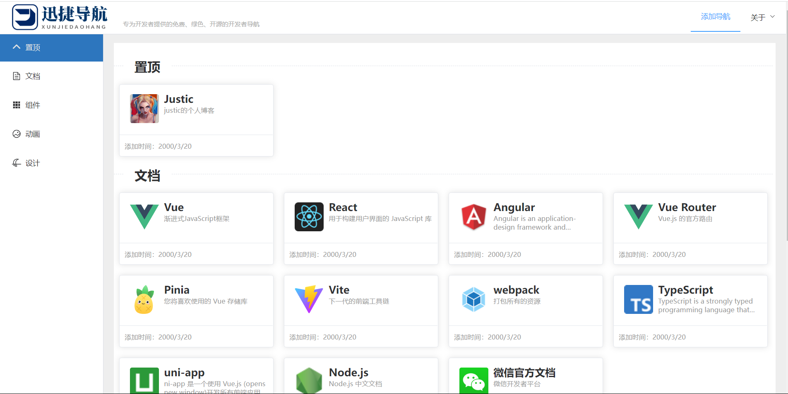

# 迅捷导航

- 专为开发者提供的免费、绿色、开源的开发者导航。

## 项目运行

```
//克隆该项目
git clone https://gitee.com/JIAXInT/navigation.git

//安装依赖
npm install

// 运行项目
npm run dev
```

## 项目介绍



介绍:专为开发者提供的免费、绿色、开源的开发者导航。

技术栈:Vue3+Vite+Vue-router+Vuex+Element Plus
